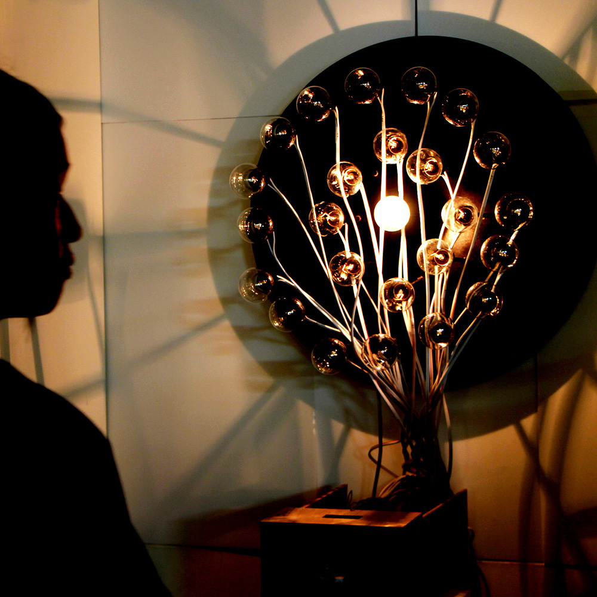

# Law of Light

## Authors
- Chin-Hsiang, Hu - https://github.com/iverson777/


## Description
"Law of Light" is a light field installation that state in totaly control, in addition to can feel the flow of light, also contains a heated tungsten filament temperature exudes energy, and in order to establish a magnetic field to produce electricity, improve the vibration noise generated quiescent current. 
behind of the light installation, actually being programmed electronic signals, generating light with people, light with network, light with  space, light with time, and give it awareness, rhythm and breathing. light not only represent the visual perception can be received, is audience participation can be affected by the governs of data network, was systematized by "Host".

## Link to Prototype
[Law of Light - Youtube](http://youtu.be/1LH7Olj_MQY "Law of Light - Youtube")

[Law of Light](https://vimeo.com/89424354 "Law of Light")

## Example Code
```
void setup() {
  Tlc.init();
  Ethernet.begin(mac,ip);
  Udp.begin(localPort);
  Serial.begin(9600);
}

```
## Links to External Libraries

[AS3 - AIR Kinect](https://github.com/AS3NUI/airkinect-2-core "AS3 - AIR Kinect")

[AS3 - Tween](http://www.greensock.com/tweenlite/ "AS3 - Tween")

[AS3 - Google](https://code.google.com/p/googleas3api/ "AS3 - Google")

[Arduino - TLC5940](https://code.google.com/p/tlc5940arduino/ "Arduino - TLC5940")


## Images & Videos


http://youtu.be/1LH7Olj_MQY

https://vimeo.com/89424354
